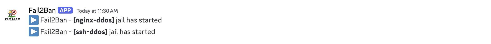
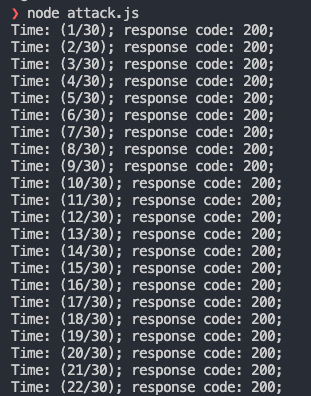
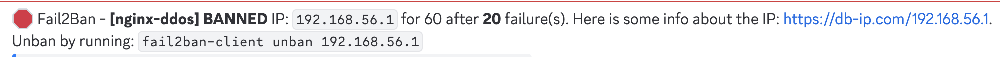

### Discord webhook to yours
[How to create webhook?](https://support.discord.com/hc/en-us/articles/228383668-Intro-to-Webhooks) 

`data/fail2ban-data/jail.d/jail.local`

```
discord_webhook=<discord-bot-url>
```

### Virtual instance
```
vagrant up
```
Hosts: 
- fail2ban.local
- h1.fail2ban.local
- h2.fail2ban.local
- h3.fail2ban.local

> Monitoring Fail2ban log
```
tail -f /var/log/fai2ban.log
```
> Check status of Fail2ban
```
sudo fail2ban-client status
```
> Check status of Fail2ban
```
sudo fail2ban-client status < nginx-ddos / ssh-ddos >
```
### Test attack
```
node attack.js
```
### Demo:

- Jails started


- Attack



- Ban IP
